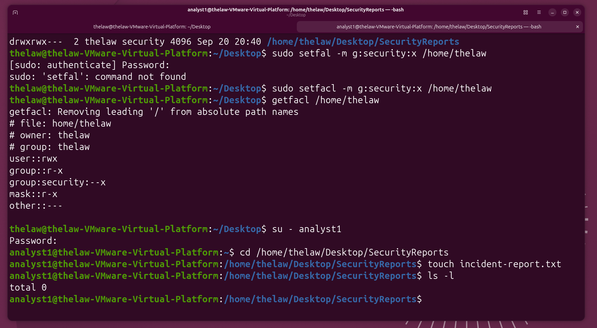
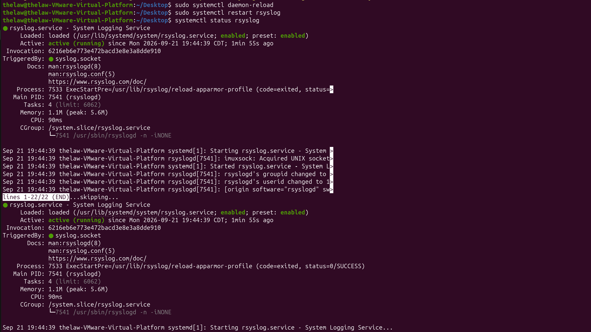

# Linux Systems Administration & Security

## Project Overview

I created this Ubuntu virtual machine in VMware to get more hands-on practice with Linux system administration and security. During the project, I worked with user and group management, file permissions, system services, troubleshooting, and authentication logs.

Instead of only practicing Linux commands, I used the lab to understand what the commands were doing, troubleshoot problems when they came up, and review system logs to see how user and administrative activity is recorded.

## Lab Environment

- Ubuntu Linux
- VMware Workstation
- Primary administrator account: `thelaw`
- Test user account: `analyst1`
- Security group: `security`

## User & Group Management

I created a separate user account named `analyst1` to practice managing users in Linux. I also created a `security` group and added users to the group to practice controlling access based on group membership.

Some of the commands I worked with included:

- `useradd` – created a new user account
- `groupadd` – created the security group
- `usermod -aG` – added users to the security group
- `id` – checked user and group membership
### User and Group Assignment

This screenshot shows the user and group configuration used in the lab, including the `analyst1` account and `security` group.

## File Permissions & Access Control

I created a `SecurityReports` directory to practice controlling access to files using Linux permissions and group ownership. I changed the directory and file permissions so members of the `security` group could work with the files while limiting access for other users.

I also tested the permissions to make sure they worked as expected and used the setgid permission so new files created in the directory would inherit the `security` group.

Some of the commands I worked with included:

- `chmod` – changed file and directory permissions
- `chgrp` – changed group ownership
- `chown` – changed file or directory ownership
- `setfacl` – configured additional group access
- `ls -l` – reviewed permissions and ownership

### Security Group Permission Test

This screenshot shows testing file access and group permissions to confirm that members of the `security` group had the expected access.

## System Services & Troubleshooting

I worked with Linux system services to practice checking whether services were running and troubleshooting them when needed. I used `systemctl` to review the status of services and worked specifically with the `rsyslog` service, which handles system logging.

While working with `rsyslog`, I made a configuration change and learned that systemd needed to reload its configuration before the service could be restarted properly. I used `systemctl daemon-reload`, restarted `rsyslog`, and checked the service again to make sure it was running.

Some of the commands I worked with included:

- `systemctl` – viewed and managed system services
- `systemctl status rsyslog` – checked the status of the rsyslog service
- `systemctl daemon-reload` – reloaded systemd after a configuration change
- `systemctl restart rsyslog` – restarted the rsyslog service

### Rsyslog Troubleshooting and Verification

This screenshot shows the rsyslog service after troubleshooting and restarting it to confirm that it was running properly.

