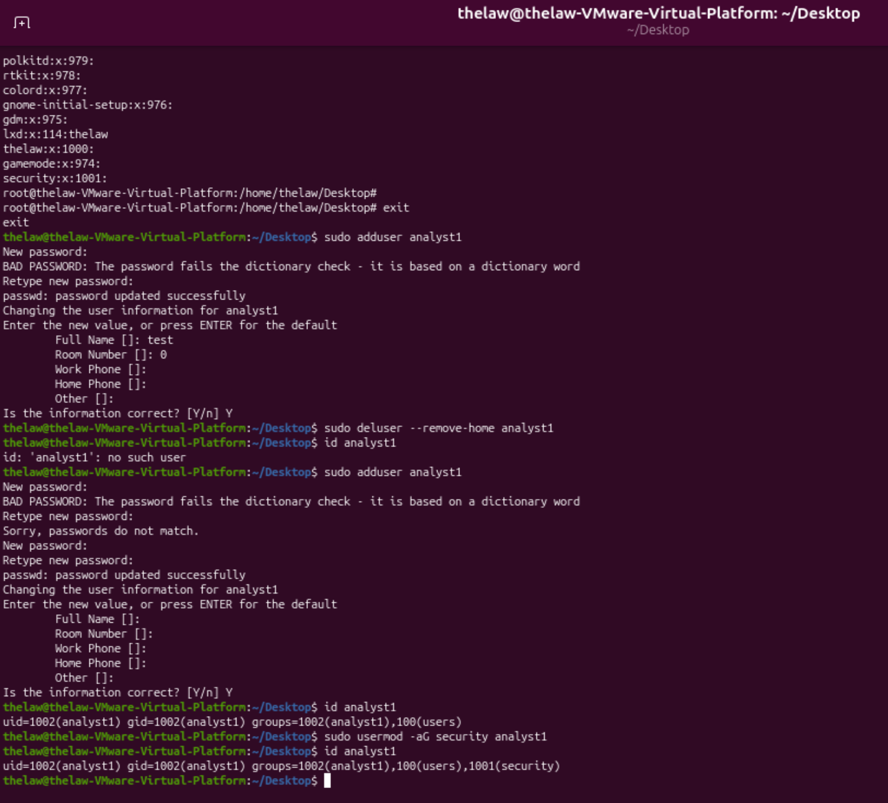

# Linux Systems Administration & Security

## Project Overview

I created this Ubuntu virtual machine in VMware to get more hands-on practice with Linux system administration and security. During the project, I worked with user and group management, file permissions, system services, troubleshooting, and authentication logs.

Instead of only practicing Linux commands, I used the lab to understand what the commands were doing, troubleshoot problems when they came up, and review system logs to see how user and administrative activity is recorded.

## Lab Environment

- Ubuntu Linux
- VMware Workstation
- Primary administrator account: `thelaw`
- Test user account: `analyst1`
- Security group: `security`

## User & Group Management

I created a separate user account named `analyst1` to practice managing users in Linux. I also created a `security` group and added users to the group to practice controlling access based on group membership.

Some of the commands I worked with included:

- `useradd` – created a new user account
- `groupadd` – created the security group
- `usermod -aG` – added users to the security group
- `id` – checked user and group membership
### User and Group Assignment

This screenshot shows the user and group configuration used in the lab, including the `analyst1` account and `security` group.

