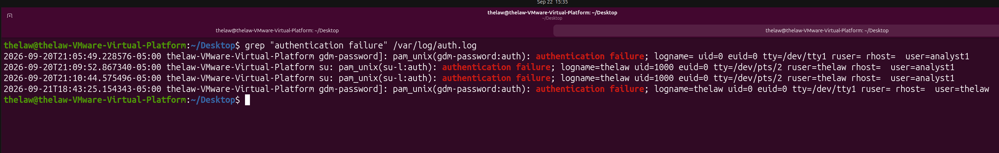
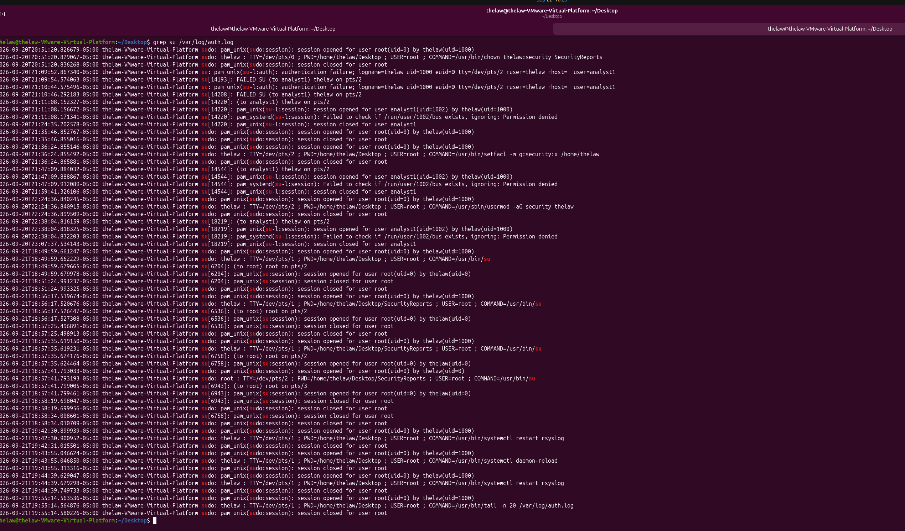

# Linux Systems Administration & Security

## Project Overview

I created this Ubuntu virtual machine in VMware to get more hands-on practice with Linux system administration and security. During the project, I worked with user and group management, file permissions, system services, troubleshooting, and authentication logs.

Instead of only practicing Linux commands, I used the lab to understand what the commands were doing, troubleshoot problems when they came up, and review system logs to see how user and administrative activity is recorded.

## Lab Environment

- Ubuntu Linux
- VMware Workstation
- Primary administrator account: `thelaw`
- Test user account: `analyst1`
- Security group: `security`

## User & Group Management

I created a separate user account named `analyst1` to practice managing users in Linux. I also created a `security` group and added users to the group to practice controlling access based on group membership.

Some of the commands I worked with included:

- `useradd` – created a new user account
- `groupadd` – created the security group
- `usermod -aG` – added users to the security group
- `id` – checked user and group membership
### User and Group Assignment

This screenshot shows the user and group configuration used in the lab, including the `analyst1` account and `security` group.

## File Permissions & Access Control

I created a `SecurityReports` directory to practice controlling access to files using Linux permissions and group ownership. I changed the directory and file permissions so members of the `security` group could work with the files while limiting access for other users.

I also tested the permissions to make sure they worked as expected and used the setgid permission so new files created in the directory would inherit the `security` group.

Some of the commands I worked with included:

- `chmod` – changed file and directory permissions
- `chgrp` – changed group ownership
- `chown` – changed file or directory ownership
- `setfacl` – configured additional group access
- `ls -l` – reviewed permissions and ownership

### Security Group Permission Test

This screenshot shows testing file access and group permissions to confirm that members of the `security` group had the expected access.

## System Services & Troubleshooting

I worked with Linux system services to practice checking whether services were running and troubleshooting them when needed. I used `systemctl` to review the status of services and worked specifically with the `rsyslog` service, which handles system logging.

While working with `rsyslog`, I made a configuration change and learned that systemd needed to reload its configuration before the service could be restarted properly. I used `systemctl daemon-reload`, restarted `rsyslog`, and checked the service again to make sure it was running.

Some of the commands I worked with included:

- `systemctl` – viewed and managed system services
- `systemctl status rsyslog` – checked the status of the rsyslog service
- `systemctl daemon-reload` – reloaded systemd after a configuration change
- `systemctl restart rsyslog` – restarted the rsyslog service

### Rsyslog Troubleshooting and Verification

This screenshot shows the rsyslog service after troubleshooting and restarting it to confirm that it was running properly.

## Authentication Log Analysis

I reviewed `/var/log/auth.log` to practice investigating user activity and authentication events. I used `grep` to narrow down the logs and look for sudo activity, authentication failures, and activity involving specific user accounts.

I found failed authentication attempts involving the `analyst1` account and reviewed the timestamps and log details to understand what happened. I also reviewed `su` activity to follow a successful account switch from `thelaw` to `analyst1` and confirm when the session opened and closed.

Some of the commands I worked with included:

- `tail` – reviewed recent authentication log entries
- `grep sudo /var/log/auth.log` – filtered sudo activity
- `grep analyst1 /var/log/auth.log` – reviewed activity for a specific user
- `grep "authentication failure" /var/log/auth.log` – found failed authentication attempts
- `grep su /var/log/auth.log` – reviewed account switching and session activity

### Authentication Failure Investigation

This screenshot shows failed authentication events involving `analyst1`. I used the timestamps and log details to identify when the failures occurred and which account was involved.

### SU Session Investigation

I reviewed the `su` activity and found that `thelaw` switched to `analyst1`. The logs showed the session successfully opened at 21:11:08 and closed at 21:24:35. Since the activity matched the account switching I performed during the lab, I treated it as expected activity rather than a security incident.

## What I Learned

This project helped me become more comfortable working in Linux from the command line instead of only learning the commands individually. I practiced managing users and groups, setting file permissions, working with system services, and troubleshooting when something did not work as expected.

The authentication log portion also gave me more practice reading logs and looking for specific activity instead of just looking at a large amount of log data. I was able to identify failed authentication attempts, follow user activity through timestamps, and determine whether activity was expected based on what was happening in the system.

Overall, this lab helped me better understand how Linux administration and security work together and gave me more hands-on experience that I can continue building on.
